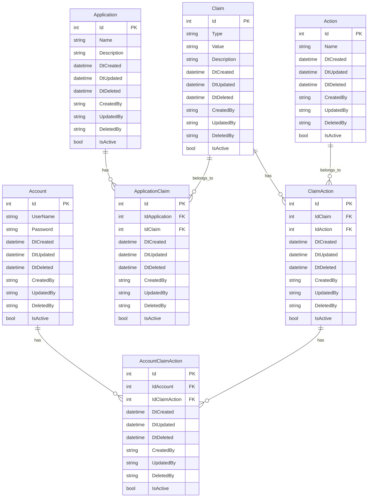
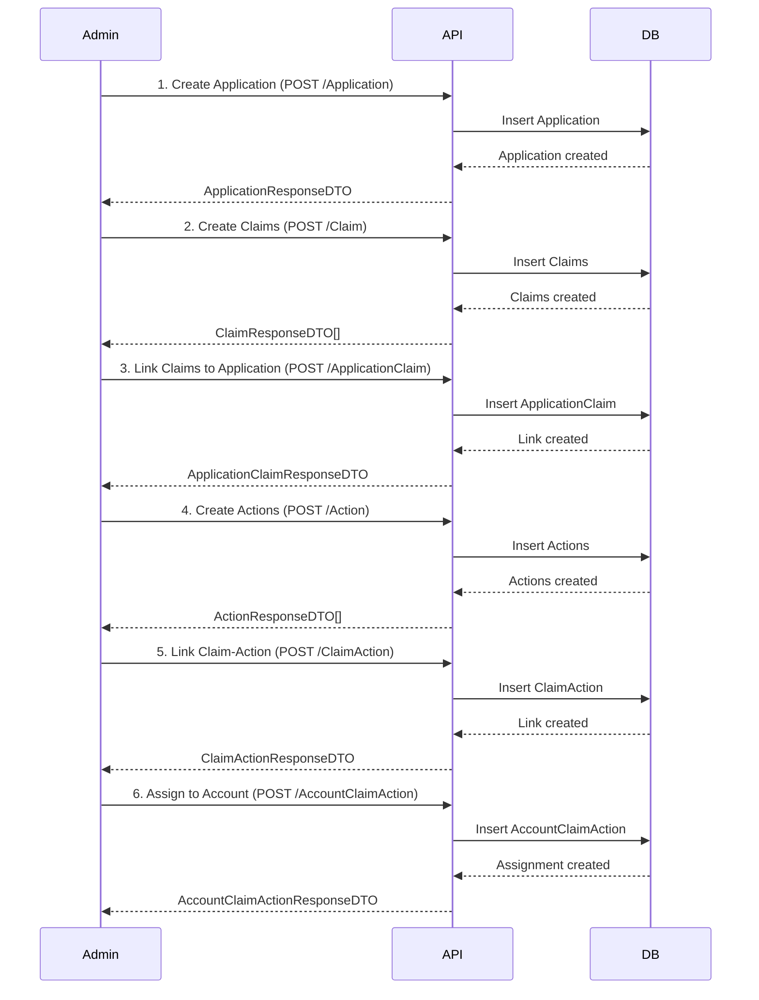
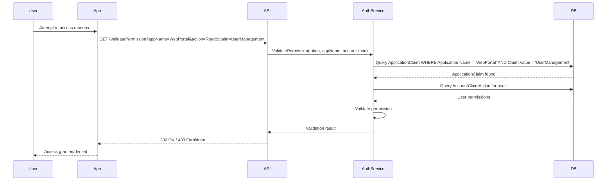
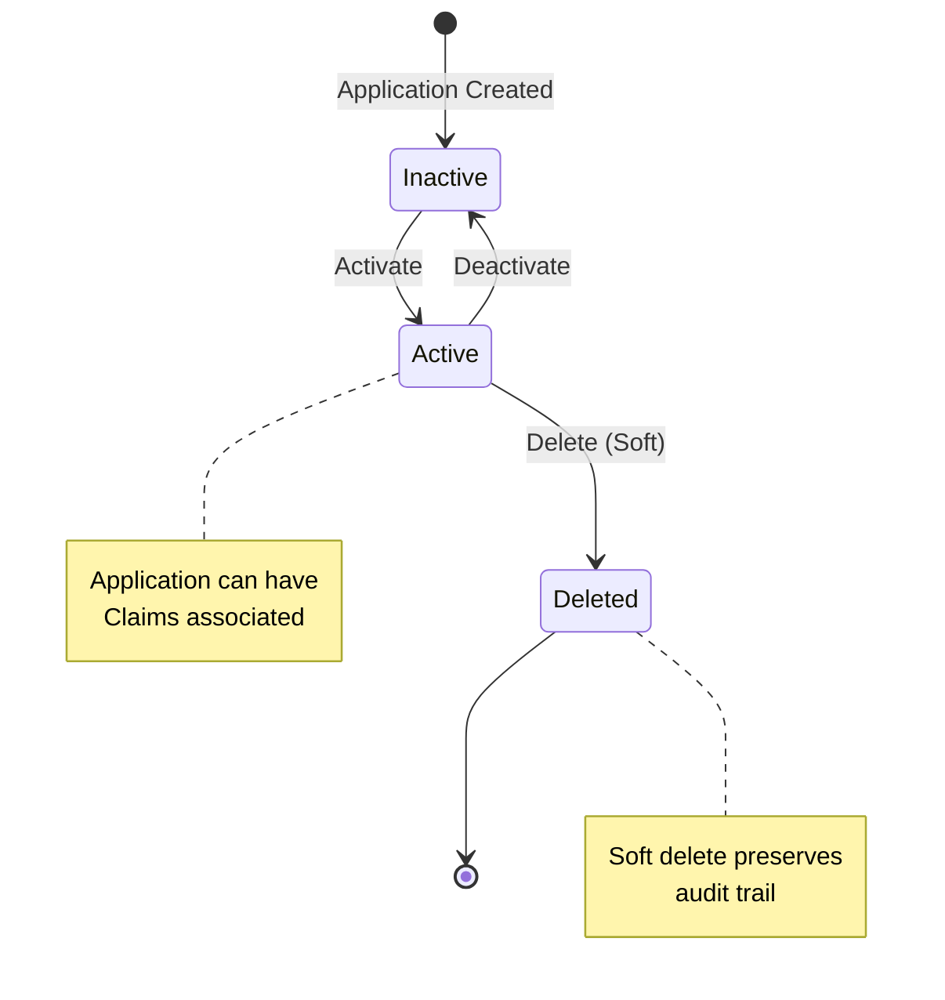

# 🏢 Application Discrimination - Multi-Tenant Permission Management

## 📋 Overview

This document describes the implementation of application discrimination in the @maiconcardozo/Authentication authentication system. This functionality allows organizing and segregating permissions (Claims) by application, enabling multi-tenant and multi-application scenarios with granular access control.

## 🎯 Purpose and Importance

### Why Application Discrimination?

Application discrimination is essential for scenarios where:

1. **Multi-Tenant**: Different clients (tenants) use the same infrastructure but require isolated permissions
2. **Multi-Application**: An organization has multiple applications (Web, Mobile, Admin, API) with different access levels
3. **Granular Control**: Need to define which permissions (Claims) are valid in each context/application
4. **Security**: Permission isolation prevents unauthorized access between applications
5. **Scalability**: Facilitates adding new applications without impacting existing ones

### Benefits

- ✅ **Permission Isolation**: Claims are linked to specific applications
- ✅ **Flexibility**: The same claim can have different actions in different applications
- ✅ **Auditability**: Clear tracking of which applications have access to which resources
- ✅ **Maintainability**: Simplified permission management per application
- ✅ **Security**: Reduced attack surface through segregation

## 🗂️ Architecture and Modeling

### Entity Relationship Diagram



### Entity Descriptions

#### **Application**
Represents an application or system in the authentication context.

**Fields:**
- `Id`: Unique identifier
- `Name`: Application name (e.g., "WebPortal", "MobileApp", "AdminPanel")
- `Description`: Detailed application description
- Audit fields (DtCreated, CreatedBy, etc.)

**Example:**
```json
{
  "id": 1,
  "name": "WebPortal",
  "description": "Main web portal for clients",
  "dtCreated": "2025-01-15T10:00:00Z",
  "createdBy": "admin"
}
```

#### **ApplicationClaim**
Many-to-many relationship table between Application and Claim.

**Fields:**
- `Id`: Unique identifier
- `IdApplication`: Application reference
- `IdClaim`: Claim reference
- Audit fields

**Purpose:** Defines which claims are available in each application.

## 🔄 Usage Flow

### Permission Configuration Flow per Application



### Permission Validation Flow



## 📦 Implemented Components

### 1. Domain Layer

#### Entities
- **Application** (`Src/Authentication.Login/Domain/Implementation/Application.cs`)
  - Properties: Id, Name, Description, LstApplicationClaim
  - Inherits from Entity (audit and soft delete)

- **ApplicationClaim** (`Src/Authentication.Login/Domain/Implementation/ApplicationClaim.cs`)
  - Properties: Id, IdApplication, IdClaim, Application, Claim
  - Many-to-many relationship

#### Interfaces
- **IApplication** (`Src/Authentication.Login/Domain/Interface/IApplication.cs`)
- **IApplicationClaim** (`Src/Authentication.Login/Domain/Interface/IApplicationClaim.cs`)

### 2. DTO Layer

#### PayLoad DTOs (Input)
- **ApplicationPayLoadDTO**: Name, Description, CreatedBy, UpdatedBy
- **ApplicationClaimPayLoadDTO**: IdApplication, IdClaim, CreatedBy, UpdatedBy

#### Response DTOs (Output)
- **ApplicationResponseDTO**: All fields including audit
- **ApplicationClaimResponseDTO**: All fields including audit

### 3. Validation Layer

#### FluentValidation Validators
- **ApplicationPayloadValidator**
  - Name: Required, no spaces, 1-100 characters
  - Description: Required, 1-500 characters
  - CreatedBy: Required, maximum 100 characters

- **ApplicationClaimPayloadValidator**
  - IdApplication: Greater than 0
  - IdClaim: Greater than 0
  - CreatedBy: Required, maximum 100 characters

### 4. Repository Layer

#### Interfaces
- **IApplicationRepository**: CRUD + GetByName, GetAllActive
- **IApplicationClaimRepository**: CRUD + GetByApplicationId, GetByClaimId, GetByApplicationAndClaim

#### Implementations
- **ApplicationRepository**: Entity Framework implementation
- **ApplicationClaimRepository**: Entity Framework implementation

### 5. Service Layer

#### Interfaces
- **IApplicationService**: GetAll, GetById, GetByName, Add, Update, Delete
- **IApplicationClaimService**: GetAll, GetById, GetByApplicationId, GetByClaimId, Add, Update, Delete

#### Implementations
- **ApplicationService**: Business logic + automatic audit
- **ApplicationClaimService**: Duplicate validation + audit

### 6. API Layer

#### Controllers
- **ApplicationController** (`Src/Authentication.API/Controllers/ApplicationController.cs`)
  - GET GetApplications: List all applications
  - GET GetApplicationById/{id}: Find by ID
  - POST AddApplication: Create new application
  - PUT UpdateApplication: Update application
  - DELETE DeleteApplication/{id}: Remove application

- **ApplicationClaimController** (`Src/Authentication.API/Controllers/ApplicationClaimController.cs`)
  - GET GetApplicationClaims: List all links
  - GET GetApplicationClaimById/{id}: Find by ID
  - GET GetApplicationClaimsByApplicationId/{applicationId}: Find by application
  - POST AddApplicationClaim: Create new link
  - PUT UpdateApplicationClaim: Update link
  - DELETE DeleteApplicationClaim/{id}: Remove link

#### Controller Characteristics
- ✅ Server-side validation with FluentValidation
- ✅ Standardized error handling (ProblemDetails)
- ✅ Standardized responses (SuccessResponse)
- ✅ Complete Swagger documentation
- ✅ Appropriate HTTP status codes (200, 400, 401, 404, 500)

### 7. Database Layer

#### Entity Configurations
- **ApplicationMap**: EF Core configuration for Application
- **ApplicationClaimMap**: EF Core configuration for ApplicationClaim

#### DbContext
- **LoginContext**: Updated with DbSet<Application> and DbSet<ApplicationClaim>

### 8. Testing Layer

#### Unit Tests
- **ApplicationPayloadValidatorTests**: 19 test scenarios
  - Valid/invalid name
  - Valid/invalid description
  - Audit fields
  - Edge cases (limits, special characters, etc.)

- **ApplicationClaimPayloadValidatorTests**: 14 test scenarios
  - Valid/invalid IdApplication
  - Valid/invalid IdClaim
  - Audit fields

## 🚀 Usage Examples

### Example 1: Create an Application

**Request:**
```http
POST /Application/AddApplication
Content-Type: application/json

{
  "name": "WebPortal",
  "description": "Main web portal for corporate clients",
  "createdBy": "admin@company.com"
}
```

**Response:**
```json
{
  "success": true,
  "message": "Request was successful.",
  "data": {
    "id": 1,
    "name": "WebPortal",
    "description": "Main web portal for corporate clients",
    "dtCreated": "2025-01-15T10:30:00Z",
    "dtDeleted": null,
    "dtUpdated": null,
    "createdBy": "admin@company.com",
    "updatedBy": null,
    "deletedBy": null
  },
  "path": "/Application/AddApplication"
}
```

### Example 2: Link Claim to Application

**Request:**
```http
POST /ApplicationClaim/AddApplicationClaim
Content-Type: application/json

{
  "idApplication": 1,
  "idClaim": 5,
  "createdBy": "admin@company.com"
}
```

**Response:**
```json
{
  "success": true,
  "message": "Request was successful.",
  "data": {
    "id": 1,
    "idApplication": 1,
    "idClaim": 5,
    "dtCreated": "2025-01-15T10:35:00Z",
    "dtDeleted": null,
    "dtUpdated": null,
    "createdBy": "admin@company.com",
    "updatedBy": null,
    "deletedBy": null
  },
  "path": "/ApplicationClaim/AddApplicationClaim"
}
```

### Example 3: List Claims of an Application

**Request:**
```http
GET /ApplicationClaim/GetApplicationClaimsByApplicationId/1
```

**Response:**
```json
{
  "success": true,
  "message": "Request was successful.",
  "data": [
    {
      "id": 1,
      "idApplication": 1,
      "idClaim": 5,
      "dtCreated": "2025-01-15T10:35:00Z",
      "createdBy": "admin@company.com"
    },
    {
      "id": 2,
      "idApplication": 1,
      "idClaim": 7,
      "dtCreated": "2025-01-15T10:40:00Z",
      "createdBy": "admin@company.com"
    }
  ],
  "path": "/ApplicationClaim/GetApplicationClaimsByApplicationId/1"
}
```

## 🔒 Usage Scenarios

### Scenario 1: Multi-Tenant E-commerce

**Context:** E-commerce platform used by multiple stores

**Implementation:**
1. Create Application for each store: "StoreA", "StoreB"
2. Create Claims: "ProductManagement", "OrderManagement", "ReportAccess"
3. Link specific claims for each store via ApplicationClaim
4. Assign permissions to users of each store

**Benefit:** StoreA users do not have access to StoreB data

### Scenario 2: Multi-Application Corporate System

**Context:** Company with separate Web, Mobile and Admin

**Implementation:**
1. Applications: "WebPortal", "MobileApp", "AdminPanel"
2. Shared claims: "UserProfile", "ChangePassword"
3. App-specific claims:
   - AdminPanel: "UserManagement", "SystemConfiguration"
   - MobileApp: "PushNotifications", "OfflineSync"
   - WebPortal: "ReportGeneration", "BulkExport"

**Benefit:** Granular control of functionalities per platform

### Scenario 3: API Gateway with Multiple Consumers

**Context:** API Gateway serving different clients (internal and external)

**Implementation:**
1. Applications: "InternalAPI", "PartnerAPI", "PublicAPI"
2. Claims with different access levels
3. Rate limiting and quotas per Application

**Benefit:** Access segregation and monitoring by client type

## 📊 State Diagram



## 🛠️ Configuration and Deployment

### Step 1: Apply Migrations

```bash
cd Src/Authentication.API
dotnet ef migrations add AddApplicationDiscrimination
dotnet ef database update
```

### Step 2: Configure DI (already implemented)

Services registered in `ServiceCollectionExtensions.cs`:
- IApplicationService / ApplicationService
- IApplicationClaimService / ApplicationClaimService
- IApplicationRepository / ApplicationRepository
- IApplicationClaimRepository / ApplicationClaimRepository

### Step 3: Configure Validators (already implemented)

Validators registered in `Startup.cs`:
- ApplicationPayloadValidator
- ApplicationClaimPayloadValidator

## 🧪 Tests

### Run Tests

```bash
cd Solution
dotnet test
```

### Test Coverage

- ✅ 19 tests for ApplicationPayloadValidator
- ✅ 14 tests for ApplicationClaimPayloadValidator
- ✅ Success, error and edge case scenarios
- ✅ 100% coverage of validation rules

## 📚 References

- [FluentValidation Documentation](https://docs.fluentvalidation.net/)
- [Entity Framework Core Relationships](https://learn.microsoft.com/en-us/ef/core/modeling/relationships)
- [ASP.NET Core Controller Best Practices](https://learn.microsoft.com/en-us/aspnet/core/web-api/)
- [Multi-Tenant Architecture Patterns](https://learn.microsoft.com/en-us/azure/architecture/guide/multitenant/overview)

## 📝 Next Steps

1. ✅ Implement Application and ApplicationClaim entities
2. ✅ Create Controllers with complete CRUD
3. ✅ Add validation with FluentValidation
4. ✅ Create unit tests
5. ⏳ Implement integration tests
6. ⏳ Add Application-based authentication to JWT
7. ⏳ Create middleware for Application validation in request context
8. ⏳ Implement permission caching per Application
9. ⏳ Add Application-specific metrics and logging

---

**Version:** 1.0.0  
**Date:** January 2025  
**Author:** Maicon Cardozo  
**Repository:** [maiconcardozo/Authentication](https://github.com/maiconcardozo/Authentication)
