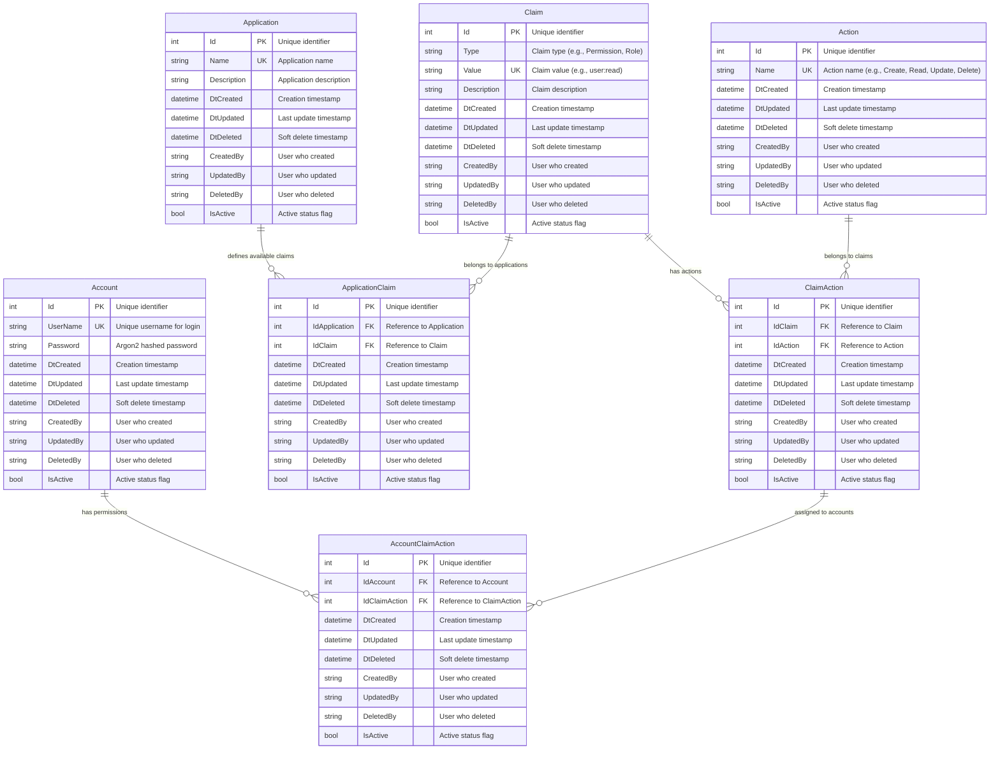

# 🏗️ Domain Model and Use Cases

## 📋 Project Overview

The Authentication service is a production-ready .NET 8.0 authentication and authorization system implementing JWT token-based authentication with comprehensive Role-Based Access Control (RBAC). Built with Clean Architecture principles, it provides secure user management with Argon2 password hashing and a complete RESTful API.

### Purpose

This service enables:
- **Secure Authentication**: JWT token-based user authentication with industry-standard security
- **Fine-Grained Authorization**: Role-Based Access Control (RBAC) with flexible claim and action mappings
- **Multi-Tenant Support**: Application discrimination for segregating permissions across applications
- **Audit Trail**: Complete audit logging for all operations with created/updated/deleted tracking
- **Scalability**: Clean Architecture design supporting horizontal scaling and extensibility

### Key Features

- 🔑 **JWT Authentication** - Stateless token-based authentication
- 👥 **User Management** - Complete account CRUD with duplicate prevention
- 🛡️ **RBAC System** - Fine-grained permissions with Claims, Actions, and mappings
- 🏢 **Application Discrimination** - Multi-tenant permission management
- 🔒 **Argon2 Security** - Memory-hard password hashing resistant to GPU attacks
- 🌐 **RESTful API** - Complete CRUD operations with proper HTTP status codes
- 🌍 **Internationalization** - English and Portuguese support
- ✅ **Validation** - FluentValidation for comprehensive input validation
- 📖 **OpenAPI/Swagger** - Interactive API documentation

## 🗂️ Domain Model

### Entity Relationship Diagram



### Entity Descriptions

#### **Account**
Represents a user account in the authentication system.

**Purpose**: Stores user credentials and manages authentication state.

**Key Properties**:
- `UserName`: Unique identifier for user login (no spaces allowed)
- `Password`: Argon2 hashed password (never stored in plain text)
- Audit fields: Complete tracking of who created/updated/deleted and when

**Business Rules**:
- Username must be unique across the system
- Passwords automatically hashed with Argon2 on creation
- Supports soft delete for maintaining audit history
- Active/inactive status for temporary account disabling

**Example Usage**:
```json
{
  "id": 1,
  "userName": "john.doe",
  "dtCreated": "2025-01-15T10:00:00Z",
  "createdBy": "system",
  "isActive": true
}
```

#### **Application**
Represents an application or system in a multi-tenant/multi-application environment.

**Purpose**: Enables permission segregation across different applications, supporting multi-tenant architectures.

**Key Properties**:
- `Name`: Unique application identifier (e.g., "WebPortal", "MobileApp", "AdminPanel")
- `Description`: Human-readable description of the application

**Business Rules**:
- Application names must be unique
- Claims can be linked to specific applications for segregation
- Supports multi-tenant scenarios with isolated permissions

**Example Usage**:
```json
{
  "id": 1,
  "name": "WebPortal",
  "description": "Main web portal for corporate clients",
  "dtCreated": "2025-01-15T10:00:00Z",
  "createdBy": "admin"
}
```

#### **Claim**
Represents a permission, role, or capability in the system.

**Purpose**: Defines what resources or features a user can access.

**Key Properties**:
- `Type`: Classification of the claim (e.g., "Permission", "Role", "Feature")
- `Value`: Unique claim identifier (e.g., "user:read", "admin", "reports:access")
- `Description`: Human-readable explanation of what the claim grants

**Business Rules**:
- Claim values must be unique
- Can be associated with multiple applications via ApplicationClaim
- Can have multiple actions via ClaimAction

**Example Usage**:
```json
{
  "id": 5,
  "type": "Permission",
  "value": "user:read",
  "description": "Allows reading user information",
  "dtCreated": "2025-01-15T10:00:00Z"
}
```

#### **Action**
Represents a system operation or action that can be performed.

**Purpose**: Defines the specific operations that can be performed on resources.

**Key Properties**:
- `Name`: Unique action identifier (e.g., "Create", "Read", "Update", "Delete", "Execute")

**Business Rules**:
- Action names must be unique
- Actions are linked to claims to create fine-grained permissions
- Follows CRUD pattern but extensible for custom operations

**Example Usage**:
```json
{
  "id": 1,
  "name": "Create",
  "dtCreated": "2025-01-15T10:00:00Z"
}
```

#### **ApplicationClaim**
Junction table linking Applications and Claims (many-to-many relationship).

**Purpose**: Defines which claims are available in each application, enabling multi-tenant permission isolation.

**Key Properties**:
- `IdApplication`: Reference to the Application
- `IdClaim`: Reference to the Claim

**Business Rules**:
- A claim can be associated with multiple applications
- An application can have multiple claims
- Prevents duplicate application-claim pairs

**Example Usage**:
```json
{
  "id": 1,
  "idApplication": 1,
  "idClaim": 5,
  "dtCreated": "2025-01-15T10:35:00Z"
}
```

#### **ClaimAction**
Junction table linking Claims and Actions (many-to-many relationship).

**Purpose**: Defines which actions can be performed with each claim, creating granular permission combinations.

**Key Properties**:
- `IdClaim`: Reference to the Claim
- `IdAction`: Reference to the Action

**Business Rules**:
- A claim can have multiple actions
- An action can belong to multiple claims
- Creates permission combinations like "user:read" + "Read" action

**Example Usage**:
```json
{
  "id": 1,
  "idClaim": 5,
  "idAction": 2,
  "dtCreated": "2025-01-15T11:00:00Z"
}
```

#### **AccountClaimAction**
Junction table linking Accounts and ClaimActions (many-to-many relationship).

**Purpose**: Assigns specific permissions to user accounts, implementing the RBAC authorization model.

**Key Properties**:
- `IdAccount`: Reference to the Account
- `IdClaimAction`: Reference to the ClaimAction

**Business Rules**:
- An account can have multiple claim-action permissions
- A claim-action can be assigned to multiple accounts
- Determines what operations a user can perform in the system

**Example Usage**:
```json
{
  "id": 1,
  "idAccount": 1,
  "idClaimAction": 1,
  "dtCreated": "2025-01-15T11:30:00Z"
}
```

## 📖 Use Cases and Flows

### Use Case 1: Account Creation

**Actors**: Anonymous User, System

**Preconditions**: None

**Flow**:
1. User provides username and password
2. System validates input (username format, password strength)
3. System checks username uniqueness
4. System hashes password using Argon2
5. System creates account with audit trail
6. System returns success response with account details

**Postconditions**: New account created and ready for authentication

**Sequence Diagram**:


**Example Request**:
```bash
curl -X POST "https://localhost:7001/Account/AddAccount" \
  -H "Content-Type: application/json" \
  -d '{
    "userName": "john.doe",
    "password": "SecurePass123!",
    "createdBy": "system"
  }'
```

**Example Response**:
```json
{
  "success": true,
  "message": "Account created successfully.",
  "data": {
    "id": 1,
    "userName": "john.doe",
    "dtCreated": "2025-01-15T10:00:00Z",
    "createdBy": "system",
    "isActive": true
  }
}
```

### Use Case 2: User Authentication and Token Generation

**Actors**: Registered User, System

**Preconditions**: User account exists and is active

**Flow**:
1. User provides username and password
2. System validates credentials
3. System retrieves user account by username
4. System verifies password hash using Argon2
5. System retrieves user permissions (AccountClaimActions)
6. System generates JWT token with user claims
7. System returns token with expiration time

**Postconditions**: User receives valid JWT token for API access

**Sequence Diagram**:


**Example Request**:
```bash
curl -X POST "https://localhost:7001/Authentication/GenerateToken" \
  -H "Content-Type: application/json" \
  -d '{
    "userName": "john.doe",
    "password": "SecurePass123!"
  }'
```

**Example Response**:
```json
{
  "success": true,
  "message": "Token generated successfully.",
  "data": {
    "accessToken": "eyJhbGciOiJIUzI1NiIsInR5cCI6IkpXVCJ9...",
    "expiration": "2025-01-15T18:00:00Z",
    "userName": "john.doe"
  }
}
```

### Use Case 3: Claim Management

**Actors**: Administrator, System

**Preconditions**: Administrator is authenticated

**Flow**:
1. Administrator creates a new claim (permission/role)
2. System validates claim data (type, value, description)
3. System checks for duplicate claim values
4. System creates claim with audit trail
5. System returns success response

**Postconditions**: New claim is available for use in RBAC

**Sequence Diagram**:


**Example Request**:
```bash
curl -X POST "https://localhost:7001/Claim/AddClaim" \
  -H "Authorization: Bearer <token>" \
  -H "Content-Type: application/json" \
  -d '{
    "type": "Permission",
    "value": "user:read",
    "description": "Allows reading user information",
    "createdBy": "admin"
  }'
```

**Example Response**:
```json
{
  "success": true,
  "message": "Claim created successfully.",
  "data": {
    "id": 5,
    "type": "Permission",
    "value": "user:read",
    "description": "Allows reading user information",
    "dtCreated": "2025-01-15T10:00:00Z",
    "createdBy": "admin"
  }
}
```

### Use Case 4: Permission Mapping (RBAC Setup)

**Actors**: Administrator, System

**Preconditions**: Claims and Actions exist in the system

**Flow**:
1. Administrator creates Action (e.g., "Read")
2. Administrator creates ClaimAction mapping (Claim + Action)
3. Administrator creates AccountClaimAction assignment (User + ClaimAction)
4. User now has the permission to perform the action

**Postconditions**: User account has specific permission assigned

**Sequence Diagram**:


**Example Flow**:

**Step 1: Create Action**
```bash
curl -X POST "https://localhost:7001/Action/AddAction" \
  -H "Authorization: Bearer <token>" \
  -H "Content-Type: application/json" \
  -d '{
    "name": "Read",
    "createdBy": "admin"
  }'
```

**Step 2: Map Claim to Action**
```bash
curl -X POST "https://localhost:7001/ClaimAction/AddClaimAction" \
  -H "Authorization: Bearer <token>" \
  -H "Content-Type: application/json" \
  -d '{
    "idClaim": 5,
    "idAction": 2,
    "createdBy": "admin"
  }'
```

**Step 3: Assign Permission to User**
```bash
curl -X POST "https://localhost:7001/AccountClaimAction/AddAccountClaimAction" \
  -H "Authorization: Bearer <token>" \
  -H "Content-Type: application/json" \
  -d '{
    "idAccount": 1,
    "idClaimAction": 1,
    "createdBy": "admin"
  }'
```

### Use Case 5: Multi-Tenant Application Discrimination

**Actors**: Administrator, System

**Preconditions**: Applications and Claims exist

**Flow**:
1. Administrator creates Application (e.g., "WebPortal")
2. Administrator creates ApplicationClaim (links Claim to Application)
3. Claims are now segregated per application
4. Users can only access claims associated with their application context

**Postconditions**: Permissions are isolated per application

**Sequence Diagram**:


**Example Flow**:

**Step 1: Create Application**
```bash
curl -X POST "https://localhost:7001/Application/AddApplication" \
  -H "Authorization: Bearer <token>" \
  -H "Content-Type: application/json" \
  -d '{
    "name": "WebPortal",
    "description": "Main web portal for corporate clients",
    "createdBy": "admin"
  }'
```

**Step 2: Link Claim to Application**
```bash
curl -X POST "https://localhost:7001/ApplicationClaim/AddApplicationClaim" \
  -H "Authorization: Bearer <token>" \
  -H "Content-Type: application/json" \
  -d '{
    "idApplication": 1,
    "idClaim": 5,
    "createdBy": "admin"
  }'
```

## 🔄 Permission and Authentication Flows

### Authentication Flow


### Authorization Flow (RBAC)


### Permission Check Flow


## 🏢 Multi-Tenant Scenarios

### Scenario 1: E-commerce Platform

**Context**: Multiple stores using the same platform

**Setup**:
- Create Applications: "StoreA", "StoreB", "StoreC"
- Create Claims: "product:manage", "order:view", "report:generate"
- Link claims to specific stores via ApplicationClaim
- Assign permissions to store employees

**Benefit**: Store employees can only access their own store's data

### Scenario 2: Corporate System

**Context**: Web, Mobile, and Admin applications

**Setup**:
- Create Applications: "WebPortal", "MobileApp", "AdminPanel"
- Shared claims: "profile:view", "password:change"
- App-specific claims:
  - AdminPanel: "user:manage", "system:config"
  - MobileApp: "notification:send", "offline:sync"
  - WebPortal: "report:export", "bulk:operation"

**Benefit**: Granular control of features per platform

### Scenario 3: API Gateway

**Context**: Different API consumers (internal, partners, public)

**Setup**:
- Create Applications: "InternalAPI", "PartnerAPI", "PublicAPI"
- Different permission levels per application
- Rate limiting per application

**Benefit**: Access segregation and monitoring by consumer type

## 🔐 Security Considerations

### Password Security
- **Argon2 Hashing**: Memory-hard algorithm resistant to GPU attacks
- **No Plain Text Storage**: Passwords never stored in plain text
- **Secure Comparison**: Constant-time comparison to prevent timing attacks

### Token Security
- **HMAC-SHA256 Signing**: Digital signature ensures token integrity
- **Expiration**: Tokens expire after configured time (default 8 hours)
- **Claims-Based**: User identity and permissions embedded in token

### API Security
- **HTTPS Required**: All communications over TLS
- **CORS Policy**: Configurable cross-origin resource sharing
- **Input Validation**: FluentValidation for all inputs
- **Audit Trail**: Complete logging of who did what and when

## 📚 Related Documentation

- **[API Reference](../api/API.md)** - Complete API endpoint documentation
- **[RBAC Guide](../api/RBAC.md)** - Role-Based Access Control setup
- **[Architecture Guide](../architecture/ARCHITECTURE.md)** - System architecture details
- **[Security Guide](../architecture/SECURITY.md)** - Security best practices
- **[Application Discrimination](../architecture/APPLICATION_DISCRIMINATION.md)** - Multi-tenant setup

---

**Version:** 1.0.0  
**Date:** January 2025  
**Author:** Maicon Cardozo  
**Repository:** [maiconcardozo/Authentication](https://github.com/maiconcardozo/Authentication)
